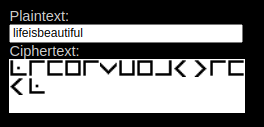

# Metoda substitutiei - Pigpen Substitution

In aceasta metoda, fiecarui caracter ii corespunde un simbol.

## Exemplu

Criptare:

  

Decriptarea se realizeaza prin aplicarea procesului invers, plecand de la simboluri si ajungand la caractere.

---

## Securitate

Metoda aceasta nu este foarte puternica, din punct de vedere al securitatii. Basandu-se in exclusivitate pe inlocuiri, un atacator nu ar avea nevoie sa *sparga* metoda, ci doar sa descrifeze, asa cum as face si destinatarul mesajului.

---

## Resurse

* https://www.simonsingh.net/The_Black_Chamber/pigpen.html
* https://en.wikipedia.org/wiki/Pigpen_cipher