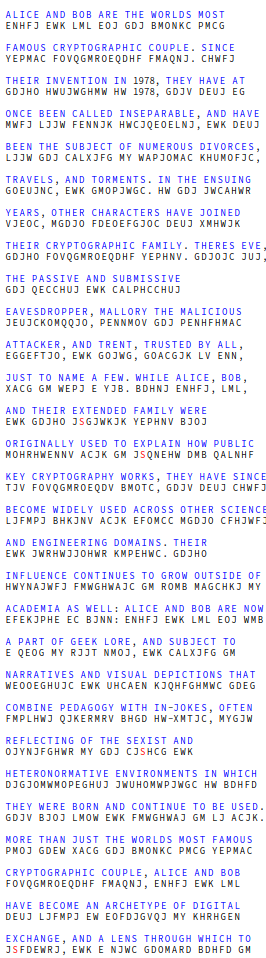

## Rezolvare

Pasi:

* E -> A
* W -> N(de la *HW 1978*, m am gandit prepozitia ce preceda anul trebuie sa fie *IN*)
* H -> I (am presupus ca *HW = IN*)
* K -> D(*EWK* -> conjunctia *AND*)
* J -> E(cea mai frecventa litera din alfabetul englez este *E*)
* O -> R
* R -> G(*JWRHWJJOHWR* -> *ENGINEERING*)
* G -> T(*WEOOEGHUJC* -> *NARRATIVE*)
* U -> V(de mai sus)
* N -> L
* D -> H(*GDEG* -> *THAT*)
* M -> O(*MGDJO* -> *OTHER*)
* B -> W(*DMB* -> *HOW*)
* V -> Y
* Y -> F
* A -> U
* F -> C
* C -> S
* L -> B
* P -> M
* Q -> P
* X -> J
* T -> K
* S -> X

Solutia:

  

---

## Resurse

* https://scottbryce.com/cryptograms/
* https://www3.nd.edu/~busiforc/handouts/cryptography/letterfrequencies.html