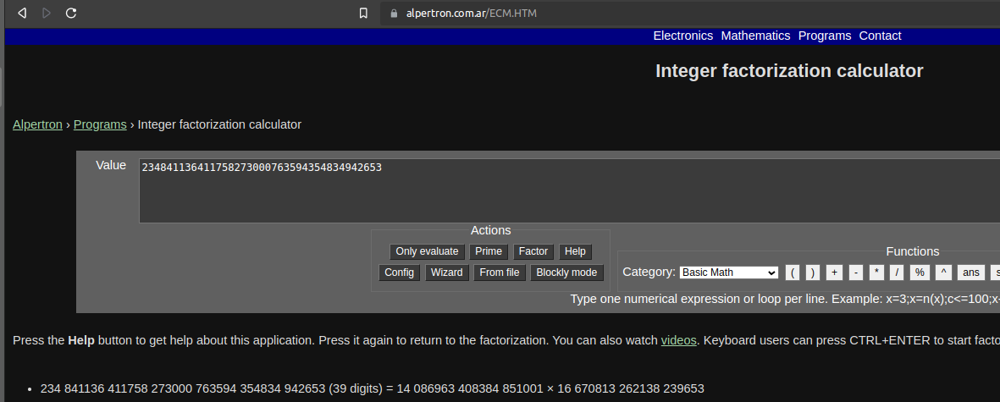
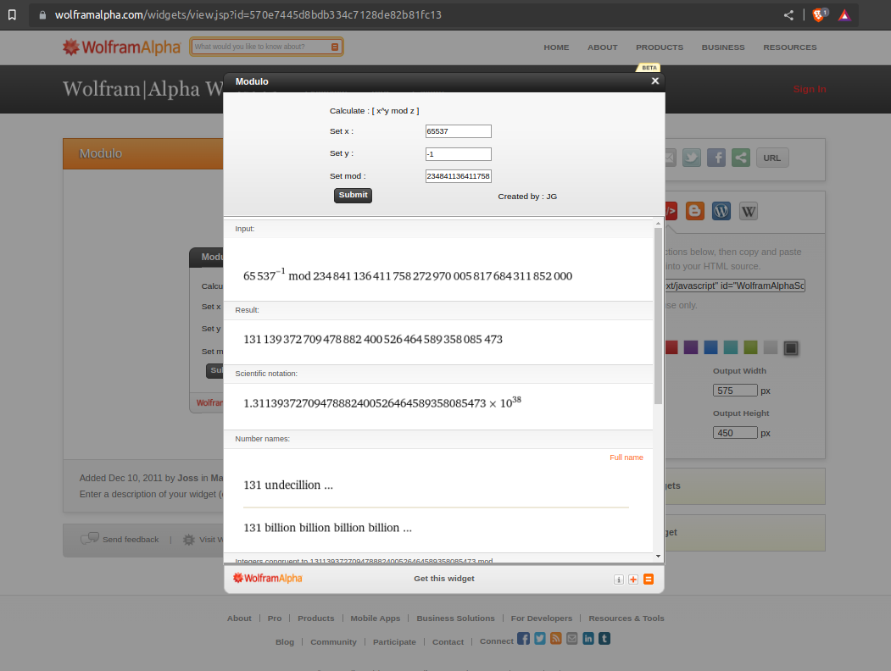

```python
N = 234841136411758273000763594354834942653
e = 65537
```

<div style="text-align: center;">
  
</div>

```python
p = 14086963408384851001
q = 16670813262138239653

# `(p - 1) * (q - 1)`.
phi = 234841136411758272970005817684311852000
```

<div style="text-align: center;">
  
</div>
